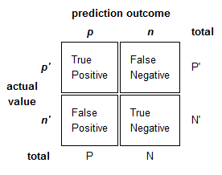
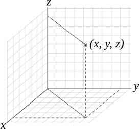

# Real World Machine Learning

---

# About Me...

Harshad

* Senior Data Scientist @ SOKRATI

* Spent last 4 years trying to understand machine learning

---

# Workshop Agenda

Machine learning is *not only* about mathematical algorithms or tools or 
vizualizations or business knowledge.

>You cannot play a symphony alone, it takes an orchestra

It involves balance of,

   1. Science
   2. Process
   3. Engineering
   4. Art

# Presenter Notes

ML : popular, identified with extremely diverse set of ideas
Sometimes we miss the forest for the trees
Books and courses focus on science.
Tool and library developers focus on engineering
A real world ML problem : needs knowledge of each aspect
Workshop and conference themed around the 4 aspects
Workshop later on science (R) and engineering (solr, aerospike)
My talk on some aspects of engineering at conference, many other talks
Closing talk on art

---

# Workshop Agenda

## Focus on process of machine learning

* Taking a real world challenging problem
* Use science, tools and some intuition
* Create a usable solution for the problem

# Presenter Notes

* Process sounds bureaucratic, but useful
* mixture of curiosity and common sense
* driven from past experiences of community

---

# What Process ?

## A real world problem

> We want to sell a product to customers through telemarketing. The last time we did 
a carpet bombing exercise. Here are bunch of data point from the effort. Tell
us what should do next time. Can you automate that insight generation ?

## Flurry of questions...

* Where to start ?
* What am I supposed to model ?
* What algorithm is better suited for this ?
* Do we have too much data ? How do I know that ?
* Do we have too little data ? How do I know that ?

# Presenter Notes

* Typical questions
* Process : systematic way of answering questions
* Bottom line : useful and practical

---

# Typical Process

* Define objective
* Get data 
* Explore
* Model
* Evaluate
* Iterate
* Validate

# Presenter Notes

* Derived through experience

* Known by other names (CRISP-DM etc.)

* Not covering get data , *conference*

--- 

# Objective

## Dataset background

[https://github.com/harshadss/my-presentations](https://github.com/harshadss/my-presentations)

* Bank marketing campaign data (S. Moro, P. Cortez and P. Rita, Jun 2014)

* Popular business problem

* Can be generalized to many other domains

# Presenter Notes

* Those who do not have : download from github or UCI ML repo

* Portugese bank, wants to sell deposit products, generalize to any marketing

---

# Start!

## Read the data

    !python
    import numpy as np

    import pandas as pd

    bank_file = './bank-full.csv'

    ind = pd.read_csv(bank_file, header = 0, delimiter = ';')

## Handshake with data

    !python

    ind.shape # How many rows ? How many columns ?

    ind.columns # What are the names of columns ?

    ind.dtypes # Are the columns read correctly ?

## Checking few observations

    !python
    ind.head()

    ind.tail() 

    ind[1:10] # Only does rows subsetting

    ind.ix[ 1:5, 1:2] # ix is special format for rows + column subsetting

    ind.ix[ 1:5, ['marital', 'y'] ] # Can use a list of col names

# Presenter Notes

* First hassle : read data, delimiters, can be other sources like db
* Top level view of data : shape, type of variables, dimensions
* Explain vars
* If rows too small, if columns > rows
* mental scan : what the cols are, types (demog, socio-economic)

---

# Drilling Down

## Check outcome variable

    !python
    ind['y'].describe() # Is it categorical or numeric ?

    ind['y'].unique() # How many unique values ?

    ind['y'].value_counts() # Count by unique values

## Checking numeric variables

    !python
    ind['age'].mean()

    ind['age'].median()

    ind['age'].describe()

## Checking numeric variable with skewness

    !python
    ind['balance'].mean()

    ind['balance'].median()

    ind['balance'].describe()

# Presenter Notes

* Drill down to individual columns
* If mean and median close : no skewness
* Balance : skewed, outliers
* Tip : Man made variables more likely to have outliers, use median to summarize

---

# Dissecting Single Variable

## Quantiles/Percentiles

Percentiles represent percentage positions in sorted data.

> 99th percentile = 10 indicates that 99 percent of data points are less than 
  or equal to 10

Percentiles are excellent way of summarizing distribution of data

    !python
    np.arange(0, 1, 0.1)
    np.arange(0, 1.1, 0.1) # arange is not right inclusive
    dist = ind['balance'].quantile(np.arange(0, 1.1, 0.1)) # Skewed distributions ?
    dist
    import matplotlib.pyplot as pl
    pl.plot(dist)
    pl.show()

## Check outliers on lower end

--- 

# Introduction to Data Transformations

Information rarely useful as-is, need to transform

    !python
    y_n_lookup = {'yes' : 1, 'no' : 0}
    ind['y_dummy'] = ind['y'].map(lambda x: y_n_lookup[x] )
    ind['y_dummy'].describe()

## How does it work ?

* Lambdas : anonymous functions

* Create a map holding transformation

* map applies the transformation to every row

# Presenter Notes

* Transformations are very important, Need to quickly identify transformations

* What is being done : map phase of map-reduce in memory

* Lambda is anonymous function : avoids writing separate function

---

# Initial Line of Attack

## Set out hypothesis/quesions

* Does age matter ?

* Does age matter in combination with marital status ?

* Do variables like balance, loan, default matter ?

# Presenter Notes
* Explain line of attack : demog, socio-economic vars

* Essentially about validating common sense/gut feeling

* Deposits are risk free products : should young people buy it ? not clear

* Motivate need of grouping, aggregation

---

# Grouping and Aggregation

# Presenter Notes

* Concept similar to mapreduce

* Example of marital status : divide by marital status, average, combine

# Grouping and Aggregation

## Does marital status affect outcome ?

    !python
    ind['marital'].value_counts()
    gb_marital = ind['y_dummy'].groupby(ind['marital'])
    gb_marital.mean()

## Does age affect outcome with marital status ?

    !python
    age_group_names = ['Young', 'Lower Middle', 'Middle', 'Senior']
    ind['age_binned'] = pd.qcut(ind['age'], 4, labels = age_group_names)
    ind['age_binned'].value_counts()
    gb_marital_age = ind['y_dummy'].groupby(ind['marital'], ind['age_binned'] )
    gb_marital_age.mean() # Oops!
    gb_marital_age.mean().unstack()
    gb_marital_age.count().unstack() # Check if enough samples in each group

# Presenter Notes

* Meaty part

* Even if you have large # of vars : youd have some gut feel on what works

* Stark difference by age + marital status

---

# Outlier Treatments and Missing Data

## Detecting outliers

    !python
    top_end = ind['balance'].quantile(np.arange(0.9, 1.01, 0.01)) # Top 10 
    top_end
    pl.plot(top_end.index, top_end.values) # Accesing index
    pl.show()
    pl.plot(top_end.index, top_end.values)
    pl.axis([0.9, 0.99, 0, 20000])
    pl.show() # Now a much better plot

## Removing outliers

    !python
    ind = ind[ind.balance <= 13000 ] # Uses broadcasting
    ind.shape # How many left now ?

## Missing data strategies

* Replace with median/mean of column
* Replace with zero
* Drop column if more than 30%-40% data missing
* Convert to bins and keep missing as separate bin

# Presenter Notes

* Why outliers removed : algos are sensitive (e.g. kmeans)

* Missing data is a reality, cannot keep dropping columns

---

# Feature Engineering

## Why and how ?

* Looking at same information from different view
* Helps treat non-linearities, too many categories
* Often differentiator between good and great results

## Creating a 'life stage' variable

    !python
    ind['life_stage'] = ind.apply(lambda x: x['age_binned'] + ' & ' + x['marital'], axis = 1)

    ind['life_stage'].value_counts()

## Creating a ratio variable of balance to age

    !python
    ind['balance_by_age'] = np.log(ind['balance'] + 10000)/(ind['age'])

    balance_by_age_labels = ['very low', 'low', 'medium', 'high', 'very high']

    ind['balance_by_age_binned'] = pd.qcut(ind['balance_by_age'], 5, labels = balance_by_age_labels)

    gb_bal_by_age = ind['y_dummy'].groupby(ind['balance_by_age_binned'] )

    gb_bal_by_age.mean().sort().order() # This is a huge insight again!

# Presenter Notes

* FE is *the* differentiator
* Making variables useful
* Often the black magic/fun part of ML

--- 

# Modeling

## What is modeling ?

> g(Y) = f(**X**)

## Model types

* Supervised learning
* Unsupervised learning
* Semi-supervised learning
* Re-inforcement learning

# Presenter Notes

* Endeavour to understand world
* X is matrix, Y is vector
* Supervised : guided by past outcomes
* Not covering semi and re-inforcement

---

# Stats Vs. ML Culture

1. Stats Culture
    1. Focus on 'why this model'
    2. Goodness of fit, hypothesis testing
    3. Regression models, survival analysis
    4. Gives basic theory
2. AI / ML Culture
    1. Focus on 'good predictions'
    2. Cross validations, ensemble of models, bias-variance
    3. neural networks, tree based models

---

# Feature and Target Data

## Creating dummies

    !python
    feature_names = ind[['life_stage', 'balance_by_age_binned', 'education', 'housing', 'loan', 'default']]

    # For every var, get dummies and eliminate one column
    df_list = [pd.get_dummies(ind[var_name], prefix = var_name).ix[:, 1 : ] for var_name in feature_names]

    feature_mat = pd.concat(df_list, axis = 1) # axis = 1 is important!

    feature_mat.shape # How many columns?

## Create target variable

    !python
    target = ind['y_dummy'] # Selected a numeric dummy variable

---

# Introduction to Random Forests

## Decision trees

* Focus on predictions, black box models
* Which variable achieves maximum separation ?
* Problem with DTrees : Overfitting

## Random forests

* Fit multiple DTrees with random samples of data
* Introduce randomness in variable selection
* Prediction by majority vote

# Presenter Notes
* Lot of courses cover regression
* Informal intro to random forests
* ENsembles :Focus on 'what data says' rather than modeling natural process
* DTree : Greedily select vars which achieve separation
* Site edwin chen
* Example : give data to friend, she asks questions looking at data, gives outcome

---

# Fitting and Simple Evaluation

## Fit 

    !python
    from sklearn.ensemble import RandomForestClassifier

    rf = RandomForestClassifier()

    model = rf.fit(feature_mat, target.values)

    raw_feature_importance = model.feature_importances_.tolist()

    feature_importance = [round(val * 100.0, 2) for val in raw_feature_importance]

    print zip(feature_mat.columns, feature_importance)

## Simple Evaluation

    !python
    model.score(feature_mat, target.values) # Wow ! But wait..

---

# Evaluation

## Importance of evaluation

* Right metric
* Metrics for classification and regressions
* Right Measurement

## Evaluating classifiers

* Precision = (True Positives)/(P)
* Recall = (True Positives)/(P')

---

# Evaluation (continued..)

    !python
    from sklearn.metrics import classification_report

    print(classification_report(model.predict(feature_mat), target.values))

# Presenter Notes

* Precision : predicted one, how many actually are ?
* Recall : of all ones, how many covered ?
* Cite Andrew Ngs course for better details

---

# Evaluation and Bias-Variance

## Bias Vs. Variance Problem

* How does the problem arise ?

* How is it solved in classical regression models ?

* How Random Forest approaches the problem ?

## Key Idea

Test on dataset with no degrees of freedom

# Presenter Notes
* Poor fit on train data : features lacking, wrong way to model problem ?
* Variance : student mugging up on exam
* Model fitting is optimization routine : so need degree of freedom = 0
* On train data : I can keep tuning params to achieve good fit

---

# Skewed Data in Real World

## Asymmetric Costs

* Predicting likely respondents for marketing campaigns

* Public Relations Disaster : Target pregnancy prediction model

* Predicting likelihood of nuclear attack and launch pre-emptive strike ?

--- 

# Iteration/Better Model

    !python
    from sklearn.cross_validation import train_test_split

    train_feature, test_feature, train_target, test_target = train_test_split(feature_mat, target.values, test_size = 0.3, random_state = 42)

    wts = np.array([5 if y == 1 else 1 for y in train_target]) # Weights  

    better_rf = RandomForestClassifier(min_samples_leaf = 10, n_jobs = -1, verbose = 1)

    better_model = better_rf.fit(train_feature, train_target, sample_weight = wts)

    print(classification_report(better_model.predict(train_feature), train_target) )

    print(classification_report(model.predict(test_feature), test_target) )

## Inference

* Can trade off precision and recall
* Default probability threshold can be changed
* Marketing campaigns : use lift as a metric

# Presenter Notes

* How handled asymmetric : weights
* How handled overfit : min samples (should be higher)
* Marketing campaigns : use sorted list, how much effort is saved etc.

---

# Introduction to Unsupervised Learning

## Idea

* Unlabelled data
* Trying to find structure

## Applications

* Customer segmentation
* Topic based classification of documents
* Reducing dimensionality of genomic datasets

---

# K-mean clustering

## How does it work ?

* Distance as a measure of similarity
* Randomly partition
* Re-calculate centroids, re-assign

## Customer segmentation on data

    !python
    from sklearn import preprocessing

    lookup = {'yes' : 1, 'no' : 0}

    ind['housing_dummy'] = ind['housing'].map(lamda x: lookup[x])

    econ_data = ind[['balance_by_age', 'housing_dummy']].as_matrix()

    econ_data_scaled = preprocessing.scale(econ_data)

    from sklearn import cluster

    k = 3 # Conventional wisdom of low-middle-wealthy class

    kmeans = cluster.KMeans(n_clusters = k)

    kmeans.fit(econ_data_scaled)

    predicted = kmeans.predict(econ_data_scaled)

    plt.scatter(econ_data_scaled[:, 0], econ_data_scaled[:, 1], c = y_pred)

# Presenter Notes

* Task : clusters based on socio-economic condition
* Trivial example : only two vars help vizualize
* Not good way : MIXING linear and binary var.
* Binary vars have different variance

---

# Curse of Unstructured Data

## Examples

* Face recognition

* Spam filtering, news article recommendations

* Detect motion in video feed for security concerns 

## Problems

* Preprocessing is harder

* Data model is not easy

---

# Vector Space Representation

## Representations

* Text, Document mining ?

* Image data ?

* Video data ?

# Presenter Notes

* Why is maths good : abstraction
* ML needs vector space : distance, similarity etc
* Text : documents as points
* Image : pixels as axis , NON-LINEAR COMBOS Neural networks
* Videos : I'm not sure, time varying data , 4D space

---

# Real World Tips

* Avoiding GIGO approach

* Importance of data model and feature engineering

* Fallacy of anticausal systems

* Fallacy of automated no-brains machine learning

* Means (big data tools) Vs. insights

---

# Recap

* Define objective
* Get data 
* Explore
* Model
* Evaluate
* Iterate
* Validate

---

# Questions ??
