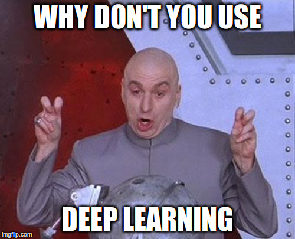

# Introduction to Recommendation Systems using __Python__

---

# About Me

## Senior Data Scientist @ Sokrati Technologies, Pune

### Recently re-branded to onlinesales.ai

## Few workshops in past with Fifth Elephant

---

# Workshop Agenda

## Write advanced recommendation algorithms

## Understand APIs of Spark and other libraries

## Solve netflix problem with higher accuracy 

---

# Real Workshop Agenda

## Understand big picture

## Understand basics

## Understand what to study

## Understand what not to study

---

# Unusual applications of recommendations?

---

# Warm Up

## Vectors are our friends

    !python
    import numpy as np

    veca = np.array([1, 2, 3, 4])
    vecb = np.array([5, 6, 7, 8])
    print veca + vecb
    print veca - vecb
    print veca.dot(vecb.T)

---

# Vectors Details

## Vectors in Physics?

## Vectors in Mathematics / Engineering courses?

## Vectors for working data scientists?

# Presenter Notes

  - We studied vectors in one way or the other
  - Physics: we studied it as quantities which have a direction and scalars as
    quantities which don't have a direction. Largely true but mechanics focussed
  - my layman explanation: any quantity which needs 2 or more numbers to 
    describe it or represent it and concept of distance makes some sense in the
    co-ordinate system

---

# Matrix

## Basics

    !python
    mata = np.random.random(6)
    mata = mata.reshape(3, 2)
    matb = np.random.random((3, 2))
    matc = mata + matb

## But what does it mean?

    !python
    vec_1 = np.random.random((1, 2))
    vec_2 = np.random.random((1, 2))
    vec_3 = vec_1 + vec_2
    res_1 = matc.dot(vec_1.T)
    res_2 = matc.dot(vec_2.T)
    res_3 = matc.dot(vec_3.T)
    np.array_equal(vec_3, (vec_1 + vec_2))

---

# Matrix : Let us do it again!

    !python
    vec_1 = np.array([1, 0])
    vec_2 = np.array([0, 1])
    
    vec_3 = np.array([0.2, 0.3])

    res_3_1 = matc.dot(vec_3.T)
    res_3_2 = matc.dot((0.2 * vec_1) + (0.3 + vec_2))
    
    print res_3_1
    print res_3_2
    np.array_equal(res_3_1, res_3_2)

## What happens to the axes?

---

# Matrix : Efficiently encode a linear operation / function / map over vectors

---

# But when will you talk about recommendations?

---

# Big Picture of Recommendations

## Represent

## Look for friends

## Optionally, look for their tastes

## Store friendship graph

## Lookup and serve

---

# Plain English Explanation: Content Based Recommendations

# Presenter Notes

  1. Represent information about the domain in a matrix
     - linear map says get output about user 1 easily
  2. Find similarity pairs between all entities
  3. Find nearest neighbours of all entities
  4. Store the information about nearest neighbours
  5. Serve nearest neighbours as recommendations
  6. Give example using Product price and category

---

# Plain English Explanation: Collaborative Filtering Recommendations

# Presenter Notes

  1. Represent information about the domain in a matrix
     - linear map says get output about user 1 easily
  2. Find similarity pairs between all entities
  3. Find nearest neighbours of all entities
  4. Find what the nearest neighbours actually like
  4. Store the information about nearest neighbours likes
  5. Serve nearest neighbours likes as recommendations
  6. Give example using sample movies and randomly generated data

---

# Working Example: Content Based

## Represent Content

    !python
    product_info = [{'price' : 10, 'product_category' : 'mobile phones'},
                    {'price' : 10.3, 'product_category' : 'mobile phones'},
                    {'price' : 18, 'product_category' : 'mobile phones'},
                    {'price' : 0.6, 'product_category' : 'shoes'},
                    {'price' : 0.5, 'product_category' : 'shoes'}]
                    
    from sklearn.feature_extraction import DictVectorizer
    vect = DictVectorizer()
    rep_mat_content = vect.fit_transform(product_info)
    rep_mat_content
    vect.feature_names_

## Build Similarity

    !python
    import sklearn.metrics as skm
    sim_mat_content = skm.pairwise_distances(rep_mat_content, metric="cosine")
    print sim_mat_content[0, :]
    print sim_mat_content[4, :]
    assert(sim_mat_content[0, 1] < sim_mat_content[0, 4])
    assert(sim_mat_content[3, 4] < sim_mat_content[3, 1])
    
---

# Working Example: Content Based

## Build Neighbours

    !python
    from sklearn.neighbors import NearestNeighbors
    
    neighbor = NearestNeighbors(n_neighbors=2, metric='precomputed')
    neighbor.fit(sim_mat_content)
    
    result_content_dist, result_content_ind = neighbor.kneighbors()

## Lookup

    !python
    product_to_lookup = 0
    neighbor_to_lookup = 0
    
    product = product_info[product_to_lookup]
    
    neighbor_index = result_content_ind[product_to_lookup][neighbor_to_lookup]
    neighbor_info = product_info[neighbor_index]
    
    print "Input is: {}".format(product)
    print "Recommendation is: {}".format(neighbor_info)

---

# Working Example: Collaborative Filtering

## Represent Content

    !python
    r_movies = ["titanic", "a walk to remember", "the notebook"]
    a_movies = ["terminator 2", "die hard", "the dark knight"]

    from scipy.stats import poisson

    users_r_r = poisson.rvs(8, size=(3, len(r_movies)))
    users_r_a = poisson.rvs(2, size=(3, len(a_movies)))
    users_r = np.hstack((users_r_r, users_r_a))

    users_a_r = poisson.rvs(2, size=(3, len(r_movies)))
    users_a_a = poisson.rvs(7, size=(3, len(a_movies)))
    users_a = np.hstack((users_a_r, users_a_a))

    user_rating_mat = np.vstack((users_r, users_a))
    
## Build Similarity

    !python
    import sklearn.metrics as skm
    sim_mat_colab = skm.pairwise_distances(user_rating_mat, metric="cosine")
    print sim_mat_colab[0, :]
    print sim_mat_colab[4, :]
    assert(sim_mat_colab[0, 1] < sim_mat_colab[0, 4])
    assert(sim_mat_colab[3, 4] < sim_mat_colab[3, 1])
    
---

# Working Example: Collaborative Filtering

## Build Neighbours

You know the drill!

## Lookup

  * Looking up is not enough!
  * Maintain set of movies liked by each neighbour
  * Set difference between movies liked by neighbour and movies liked by current user

---

# Quick Recap

---

# Recommendations In Real World

## Problems in modeling

## Problems in engineering

# Presenter Notes
Going superfast for next few slides!

---

# Real World Problems: Modeling

## Redundancy in Data, Compression

## Handling Implicit Feedback

## Which Metric To Optimize?

## Handle Cold Start With Implicit Feedback

## Brain Explosion!

---

# Redundancy in Data, Compression

---

# Most Important Equation

## Singular Value Decomposition

## Netflix Competition (Simon Funk et. al.)

## Scaling SVD Computation

---

> You will need 2 Gig of ram, a C compiler, and good programming habits to do this (...)
>  My wee laptop is able to do a training pass through the entire data set of 100 million ratings in about seven and a half seconds. (Simon Funk, Blog on Netflix competition)

---

# Handling Implicit Feedback

---

# Implicit Feedback Through Confidence

## Preference, not rating

## More implicit feedback, higher confidence in preference

## Still computing (similar to) SVD

## Quadratic objective and other mathematical tricks

---

# Which Metric To Optimize?

---

# Bayesian Personalized Ranking

## Interesting Objective Criteria (Stefen Rendle et.al.)

## Work on pairs between seen and randomly drawn observations

## Still computing (similar to) SVD

## Bayesian objetive criteria, bootstrap sampling and other mathematical tricks

---

# Handle Cold Start With Implicit Feedback

---

# Metadata Embeddings 

## Hybrid matrix factorization model (Maciej Kula)

## Handles cold start well

## Brain explosion!

## But a readable implementation

## Super performant Python implementation

---

# Real World Problems: Engineering

## Scaling/Handling Storage Size

### Sparse matrix tricks

### De-noising of data

## Scaling Training Horizontally

### Stochastic gradient descent

### Alternating least squares

## Scaling Training by Going Deep

### Vector instructions on CPU

### GPU?

## Scaling Lookups

### Approximate nearest neighbours

## Scaling Serving

### ???

---

# Scaling Lookups

    !python
    rating_mat = poisson.rvs(5, size=(100, 10000))
    from sklearn.neighbors import LSHForest
    lsfh = LSHForest(random_state=42)
    lsfh.fit(rating_mat)
    result_approx_dist, result_approx_ind = lsfh.kneighbors(rating_mat, n_neighbors=2)
    result_approx_dist[0:10, :]

---
    
# What Should You Care About

## Understand basic mathematics thoroughly

## Which modelling trick to use?

## Which objective function trick to use?

## Do I really have big data?

---

# Old School Data Scientist's Advice

1. De-noise your data first

2. Think hard about the model assumptions
    * Apache Spark / ALS : repeat interaction with same product, gaussian assumptions
    * Most of the models : SVD, homogeneous data Vs. heterogeneous data

3. Prefer debuggability over cleverness

4. Whenever in doubt (always!) stay away from distributed computation

5. Whenever in doubt (almost!) use Python

---

# Obligatory 1

---

# Obligatory 2

    !python
    import this

---

# Further Study

## Linear Algebra

### Gilbert Strang (LA Book)

## Calculus

### Kalid Azad (Better Explained)
### Gilbert Strang (Calculus book)

## Scaling Tricks

### Read the source code!

## Objective Function Tricks

### Read the original papers!

---

# Rock On!
